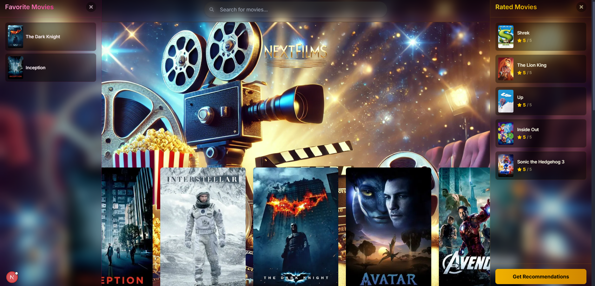

# NextFilms: Kişiselleştirilmiş Film Öneri Sistemi

[](frontend/public/images/ana_ekran.png)

Bu proje, kullanıcılara izledikleri ve puanladıkları filmlere göre kişiselleştirilmiş film önerileri sunan modern bir web uygulamasıdır. MovieLens veri seti ve TMDB API kullanılarak geliştirilmiştir.

## 🚀 Öne Çıkan Özellikler

*   **Film Keşfet:** Geniş bir film kataloğunu listeleyin ve popüler filmleri keşfedin.
*   **Akıllı Arama:** Film adına göre anlık arama yapın ve sonuçları hızla görün.
*   **Film Detayları:** TMDB API entegrasyonu sayesinde filmlerin özetini, türünü, oyuncu kadrosunu ve daha fazlasını içeren detaylı bilgilere modal pencerede erişin.
*   **Puanlama:** Filmleri 1-5 yıldız arası puanlayın. Puanlarınız öneri algoritmasını besler ve yerel depolamada saklanır.
*   **Favoriler:** Beğendiğiniz filmleri favori listenize ekleyin ve kolayca erişin.
*   **Kişiselleştirilmiş Öneriler:** Puanladığınız filmlere dayanarak, Collaborative Filtering (SVD ile) modelini kullanan backend servisinden size özel film önerileri alın.
*   **Modern Arayüz:** React, Next.js, Tailwind CSS ve Framer Motion ile oluşturulmuş, Glassmorphism efektleri ve akıcı animasyonlarla zenginleştirilmiş kullanıcı dostu bir arayüz.
*   **Mobil Uyumlu Tasarım:** Farklı ekran boyutlarında (PC, tablet, mobil) sorunsuz bir deneyim sunar.

## 🛠️ Kullanılan Teknolojiler

*   **Backend:**
    *   **Python:** Ana programlama dili.
    *   **Flask:** Web framework'ü.
    *   **Pandas:** Veri manipülasyonu ve analizi.
    *   **Scikit-learn:** Makine öğrenimi (SVD modeli için).
    *   **Joblib:** Eğitilmiş modelin diske kaydedilmesi ve yüklenmesi.
    *   **Gunicorn:** Üretim ortamı için WSGI HTTP sunucusu.
*   **Frontend:**
    *   **Next.js:** React framework'ü (SSR, Routing vb.).
    *   **React:** Kullanıcı arayüzü kütüphanesi.
    *   **TypeScript:** Statik tipleme ile daha güvenli kod geliştirme.
    *   **Tailwind CSS:** Hızlı UI geliştirme için yardımcı sınıf tabanlı CSS framework'ü.
    *   **Framer Motion:** Akıcı animasyonlar ve geçişler.
    *   **Axios:** HTTP istekleri için.
*   **Veri Kaynakları:**
    *   **MovieLens ml-latest:** Film derecelendirme veri seti.
    *   **The Movie Database (TMDB) API:** Film meta verileri (özet, afiş, tür vb.).
*   **Deployment:**
    *   **Render:** Backend ve Frontend uygulamalarının bulutta barındırılması (Denendi, ancak bellek sorunları nedeniyle ücretsiz katmanda başarılı olunamadı).
    *   **AWS S3:** Eğitilmiş model dosyasının depolanması.
*   **Diğer Araçlar:**
    *   **Git & GitHub:** Versiyon kontrolü ve kod deposu.
    *   **VS Code & Cursor:** Kod editörü ve AI destekli geliştirme.

## ⚙️ Kurulum ve Çalıştırma

Projeyi yerel makinenizde çalıştırmak için aşağıdaki adımları takip edin:

### Gereksinimler

*   Python 3.8 veya üzeri
*   Node.js 16 veya üzeri
*   npm veya yarn
*   [TMDB API Anahtarı](https://www.themoviedb.org/settings/api)

### Backend Kurulumu

1.  **Proje Klonlama:**
    ```bash
    git clone <repository_url>
    cd <repository_name>/backend
    ```
2.  **Veri Setini İndirme ve Yerleştirme:**
    *   [MovieLens Latest Datasets](https://grouplens.org/datasets/movielens/latest/) sayfasından **ml-latest.zip** dosyasını indirin.
    *   Zip dosyasını açın ve içindeki `ml-latest` klasörünün içeriğini (özellikle `ratings.csv`, `movies.csv`, `links.csv` dosyalarını) projenizdeki `backend/data/` klasörüne kopyalayın.
    *   **Önemli Not:** `ratings.csv` dosyası çok büyük olduğu için (`~900MB`) `.gitignore` dosyası ile Git deposuna **dahil edilmemiştir**. Bu dosyayı manuel olarak indirip eklemeniz gerekmektedir.
3.  **Sanal Ortam Oluşturma ve Aktifleştirme:**
    ```bash
    # Windows
    python -m venv venv
    .\venv\Scripts\activate

    # macOS/Linux
    python3 -m venv venv
    source venv/bin/activate
    ```
4.  **Bağımlılıkları Yükleme:**
    ```bash
    pip install -r requirements.txt
    ```
5.  **`.env` Dosyası Oluşturma:**
    `backend` klasöründe `.env` adında bir dosya oluşturun ve içine TMDB API anahtarınızı ekleyin:
    ```env
    TMDB_API_KEY=YOUR_TMDB_API_KEY
    ```
6.  **Model Dosyası:**
    *   Eğitilmiş model (`.joblib` dosyası) normalde S3'den indirilir (`app.py` içindeki `MODEL_DOWNLOAD_URL` ile). Yerel çalıştırma için, ya bu URL'nin geçerli olduğundan ve model dosyasının S3'te bulunduğundan emin olun ya da modeli yerel olarak eğitip (`python models/collaborative_filter.py train` komutu ile) oluşan dosyayı `backend/models/` altına koyun ve indirme mantığını `app.py` içinde geçici olarak devre dışı bırakın/yorum satırı yapın.
7.  **Uygulamayı Çalıştırma:**
    ```bash
    flask run
    ```
    Backend varsayılan olarak `http://127.0.0.1:5000` adresinde çalışacaktır.

### Backend Dosya Yapısı ve Açıklamaları

```
backend/
├── data/               # Manuel olarak indirilen MovieLens veri setinin bulunacağı yer (Git'e dahil değil).
├── models/             # Makine öğrenimi modeli kodları ve S3'ten indirilen/yerel olarak eğitilen model dosyası.
│   ├── collaborative_filter.py  # Collaborative Filtering modelini (SVD) eğiten, yükleyen ve tahmin yapan sınıf.
│   └── [MODEL_FILENAME].joblib # Eğitilmiş model dosyası (örn: cf_svd_model_data_k10_v1.joblib).
├── utils/              # Yardımcı fonksiyonlar.
│   └── preprocess.py   # Ham MovieLens verisini okuyan ve işleyen fonksiyonlar (şu an doğrudan app.py içinde kullanılıyor).
├── venv/               # Python sanal ortamı (Git'e dahil değil).
├── .env                # Ortam değişkenleri (TMDB API Key) (Git'e dahil değil).
├── app.py              # Ana Flask uygulaması: API endpoint'lerini tanımlar, modeli yükler, istekleri yönetir.
└── requirements.txt    # Gerekli Python kütüphaneleri ve sürümleri.
```

### Frontend Kurulumu

1.  **Frontend Klasörüne Geçme:**
    ```bash
    cd ../frontend
    ```
2.  **Bağımlılıkları Yükleme:**
    ```bash
    npm install
    # veya
    yarn install
    ```
3.  **`.env.local` Dosyası Oluşturma:**
    `frontend` klasöründe `.env.local` adında bir dosya oluşturun ve içine backend API adresini ve TMDB API anahtarınızı ekleyin:
    ```env
    NEXT_PUBLIC_API_URL=http://127.0.0.1:5000/api
    NEXT_PUBLIC_TMDB_API_KEY=YOUR_TMDB_API_KEY
    ```
4.  **Uygulamayı Çalıştırma:**
    ```bash
    npm run dev
    # veya
    yarn dev
    ```
    Frontend varsayılan olarak `http://localhost:3000` adresinde çalışacaktır.

## ☁️ Deployment ve Karşılaşılan Zorluklar

Bu uygulama **Render** platformunda canlıya alınmaya çalışılmıştır. Ancak, Render'ın ücretsiz katmanındaki **512 MB RAM limiti**, Collaborative Filtering (SVD) modelinin ve ilgili veri yapılarının (Pandas DataFrames vb.) belleğe yüklenmesi sırasında **"Out of Memory" (Bellek Yetersiz)** hatalarına neden olmuştur.

Bu zorluğun üstesinden gelmek için aşağıdaki adımlar denenmiştir:

1.  **Model Küçültme:** SVD modelinin karmaşıklığı, `n_components` parametresi `100`'den `10`'a düşürülerek azaltıldı. Bu, modelin disk boyutunu ve teorik bellek ihtiyacını önemli ölçüde azalttı.
2.  **Memory Mapping (`mmap_mode`):** Backend kodunda, `joblib.load` fonksiyonu ile model yüklenirken `mmap_mode='r'` parametresi kullanıldı. Bu teknik, modelin büyük NumPy dizilerinin tamamını RAM'e kopyalamak yerine, disk üzerindeki dosya içeriğini sanal belleğe eşleyerek bellek kullanımını azaltmayı hedefler.

**Sonuç:** Yapılan optimizasyonlara rağmen (`n_components=10` ve `mmap_mode`), uygulamanın toplam bellek kullanımı Render'ın ücretsiz katmanındaki 512 MB limitini **aşmaya devam etmiştir**. Bu nedenle, proje bu yapılandırma ile Render'ın ücretsiz katmanında **başarılı bir şekilde deploy edilememiştir**. Daha yüksek bellek limitlerine sahip bir platform veya daha agresif optimizasyon teknikleri (örn: daha küçük veri setleri kullanmak, farklı model türleri denemek, Pandas yerine daha az bellek tüketen kütüphaneler araştırmak) gerekmektedir.

Bu deneyim, kaynak kısıtlı ortamlarda büyük makine öğrenimi modellerini dağıtırken karşılaşılan yaygın zorlukları ve optimizasyon denemelerinin sınırlarını göstermektedir.

## 🖼️ Ekran Görüntüsü


## 🔮 Gelecek Geliştirmeler

*   Daha gelişmiş öneri algoritmaları entegrasyonu (örn: içerik tabanlı filtreleme, hibrit yaklaşımlar).
*   Kullanıcı profilleri ve kimlik doğrulama.
*   Modelin periyodik olarak otomatik yeniden eğitimi.
*   Daha kapsamlı testler (birim, entegrasyon, uçtan uca).
*   Performans optimizasyonları (API yanıt süreleri, veri yükleme stratejileri).
*   Farklı hosting platformları veya ücretli planların değerlendirilmesi.

---

Umarım bu güncellenmiş README dosyası projeni daha doğru ve detaylı bir şekilde tanıtır Aliqo!

---

# NextFilms: Personalized Movie Recommendation System

[](frontend/public/images/ana_ekran.png)

This project is a modern web application that provides users with personalized movie recommendations based on the movies they watch and rate. It is developed using the MovieLens dataset and the TMDB API.

## 🚀 Key Features

*   **Discover Movies:** Browse a large movie catalog and discover popular films.
*   **Smart Search:** Instantly search for movies by title and see results quickly.
*   **Movie Details:** Access detailed information including summaries, genres, cast, and more in a modal window, thanks to TMDB API integration.
*   **Rating:** Rate movies from 1 to 5 stars. Your ratings feed the recommendation algorithm and are stored locally.
*   **Favorites:** Add movies you like to your favorites list for easy access.
*   **Personalized Recommendations:** Get custom movie recommendations from the backend service, which uses a Collaborative Filtering (with SVD) model based on the movies you've rated.
*   **Modern Interface:** A user-friendly interface built with React, Next.js, Tailwind CSS, and Framer Motion, enhanced with Glassmorphism effects and smooth animations.
*   **Mobile-Friendly Design:** Provides a seamless experience across different screen sizes (PC, tablet, mobile).

## 🛠️ Technologies Used

*   **Backend:**
    *   **Python:** Main programming language.
    *   **Flask:** Web framework.
    *   **Pandas:** Data manipulation and analysis.
    *   **Scikit-learn:** Machine learning (for the SVD model).
    *   **Joblib:** Saving and loading the trained model to disk.
    *   **Gunicorn:** WSGI HTTP server for production environment.
*   **Frontend:**
    *   **Next.js:** React framework (SSR, Routing, etc.).
    *   **React:** User interface library.
    *   **TypeScript:** Safer code development with static typing.
    *   **Tailwind CSS:** Utility-first CSS framework for rapid UI development.
    *   **Framer Motion:** Smooth animations and transitions.
    *   **Axios:** For HTTP requests.
*   **Data Sources:**
    *   **MovieLens ml-latest:** Movie rating dataset.
    *   **The Movie Database (TMDB) API:** Movie metadata (summary, poster, genre, etc.).
*   **Deployment:**
    *   **Render:** Cloud hosting platform (Attempted, but unsuccessful on the free tier due to memory constraints).
    *   **AWS S3:** Storage for the trained model file.
*   **Other Tools:**
    *   **Git & GitHub:** Version control and code repository.
    *   **VS Code & Cursor:** Code editor and AI-assisted development.

## ⚙️ Setup and Running

Follow these steps to run the project on your local machine:

### Prerequisites

*   Python 3.8 or higher
*   Node.js 16 or higher
*   npm or yarn
*   [TMDB API Key](https://www.themoviedb.org/settings/api)

### Backend Setup

1.  **Clone the Project:**
    ```bash
    git clone <repository_url>
    cd <repository_name>/backend
    ```
2.  **Download and Place Dataset:**
    *   Download the **ml-latest.zip** file from the [MovieLens Latest Datasets](https://grouplens.org/datasets/movielens/latest/) page.
    *   Extract the zip file and copy the contents of the `ml-latest` folder (specifically `ratings.csv`, `movies.csv`, `links.csv`) into the `backend/data/` directory within your project.
    *   **Important Note:** The `ratings.csv` file is very large (`~900MB`) and is **not included** in the Git repository (via `.gitignore`). You must download and add this file manually.
3.  **Create and Activate Virtual Environment:**
    ```bash
    # Windows
    python -m venv venv
    .\venv\Scripts\activate

    # macOS/Linux
    python3 -m venv venv
    source venv/bin/activate
    ```
4.  **Install Dependencies:**
    ```bash
    pip install -r requirements.txt
    ```
5.  **Create `.env` File:**
    Create a file named `.env` in the `backend` folder and add your TMDB API key:
    ```env
    TMDB_API_KEY=YOUR_TMDB_API_KEY
    ```
6.  **Model File:**
    *   The trained model (`.joblib` file) is normally downloaded from S3 (via `MODEL_DOWNLOAD_URL` in `app.py`). For local execution, either ensure this URL is valid and the model file exists on S3, or train the model locally (using the command `python models/collaborative_filter.py train`), place the resulting file under `backend/models/`, and temporarily disable/comment out the download logic in `app.py`.
7.  **Run the Application:**
    ```bash
    flask run
    ```
    The backend will run by default at `http://127.0.0.1:5000`.

### Backend File Structure and Descriptions

```
backend/
├── data/               # Location for the manually downloaded MovieLens dataset (Not in Git).
├── models/             # ML model code and the downloaded/locally trained model file.
│   ├── collaborative_filter.py  # Class to train, load, and predict using the Collaborative Filtering (SVD) model.
│   └── [MODEL_FILENAME].joblib # The trained model file (e.g., cf_svd_model_data_k10_v1.joblib).
├── utils/              # Utility functions.
│   └── preprocess.py   # Functions to read and process raw MovieLens data (currently used directly in app.py).
├── venv/               # Python virtual environment (Not in Git).
├── .env                # Environment variables (TMDB API Key) (Not in Git).
├── app.py              # Main Flask application: defines API endpoints, loads the model, handles requests.
└── requirements.txt    # Required Python libraries and their versions.
```

### Frontend Setup

1.  **Navigate to Frontend Folder:**
    ```bash
    cd ../frontend
    ```
2.  **Install Dependencies:**
    ```bash
    npm install
    # or
    yarn install
    ```
3.  **Create `.env.local` File:**
    Create a file named `.env.local` in the `frontend` folder and add the backend API address and your TMDB API key:
    ```env
    NEXT_PUBLIC_API_URL=http://127.0.0.1:5000/api
    NEXT_PUBLIC_TMDB_API_KEY=YOUR_TMDB_API_KEY
    ```
4.  **Run the Application:**
    ```bash
    npm run dev
    # or
    yarn dev
    ```
    The frontend will run by default at `http://localhost:3000`.

## ☁️ Deployment and Challenges Faced

This application was attempted to be deployed on the **Render** platform. However, the **512 MB RAM limit** on Render's free tier caused **"Out of Memory"** errors during the loading of the Collaborative Filtering (SVD) model and associated data structures (like Pandas DataFrames).

The following steps were attempted to overcome this challenge:

1.  **Model Size Reduction:** The complexity of the SVD model was reduced by decreasing the `n_components` parameter from `100` to `10`. This significantly reduced the model's disk size and theoretical memory requirement.
2.  **Memory Mapping (`mmap_mode`):** In the backend code, the `mmap_mode='r'` parameter was used with the `joblib.load` function when loading the model. This technique aims to reduce memory usage by mapping the file content on disk to virtual memory instead of copying the entire large NumPy arrays into RAM.

**Outcome:** Despite these optimizations (`n_components=10` and `mmap_mode`), the application's total memory usage **still exceeded** the 512 MB limit on Render's free tier. Therefore, the project **could not be successfully deployed** on Render's free tier with this configuration. A platform with higher memory limits or more aggressive optimization techniques (e.g., using smaller datasets, trying different model types, investigating less memory-intensive libraries than Pandas) would be required.

This experience highlights the common challenges of deploying large machine learning models in resource-constrained environments and the limits of optimization attempts.

## 🖼️ Screenshot


## 🔮 Future Enhancements

*   Integration of more advanced recommendation algorithms (e.g., content-based filtering, hybrid approaches).
*   User profiles and authentication.
*   Periodic automatic retraining of the model.
*   More comprehensive testing (unit, integration, end-to-end).
*   Performance optimizations (API response times, data loading strategies).
*   Evaluation of different hosting platforms or paid plans.

---

I hope this updated README file represents your project more accurately and in detail, Aliqo!

